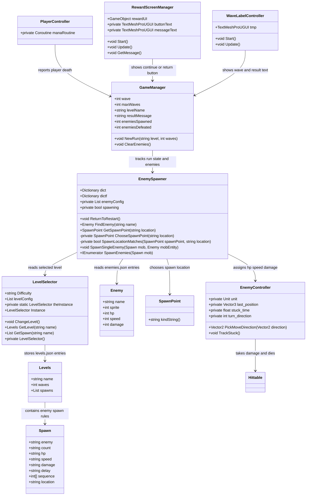

# CMPM 121 Assignment 2 Report

## Architecture Diagram

## Architecture Description

The level and enemy data are loaded from JSON into small data classes. `LevelSelector` stores the available level definitions, while `EnemySpawner` reads enemy definitions and uses the selected level's spawn rules to create enemies each wave. Spawn rules can choose enemy type, count, HP, damage, delay, sequence, and spawn location.

`GameManager` stores the current game state, wave number, enemy count, and simple run stats. `EnemyController` handles enemy movement and attacks, while `PlayerController` starts the player stats and reports game over when the player dies. `RewardScreenManager` reuses the existing reward screen button for either continuing to the next wave or returning to the start after victory or defeat.

## Added Classes And Methods

- Added classes `Levels` and `Spawn` for storing levels.json into a new class: `LevelSelector`.
- Added class `Enemy` for storing enemies.json.
- Added fields to `Enemy` for JSON enemy stats.
- Added `speed` and `damage` fields to `Spawn`.
- Added `LevelSelector.GetLevel`.
- Added wave/end-state fields and helper methods in `GameManager`.
- Added data-driven spawn helpers in `EnemySpawner`.
- Added enemy `damage` support and movement stopping in `EnemyController`.
- Updated `RewardScreenManager` and `WaveLabelController` to display wave, victory, and defeat states.
- Added two new enemy types: "medusa" (in Endless mode) and "ghost" (in Medium difficulty) to enemies.json and levels.json.

## Contributions

Todd Crandell fixed bugs and enemy movement behavior, including stopping enemies correctly while attacking and using configured enemy damage.

Branson Guan worked on the initial assignment implementation, including the level selection flow, level JSON structure, and wave spawning setup.

Saurav Shah worked on the initial assignment implementation, including enemy JSON data, enemy type setup, additional enemy types, and spawn rule integration.
